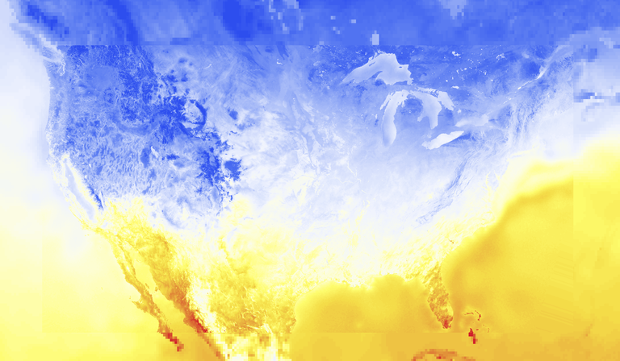
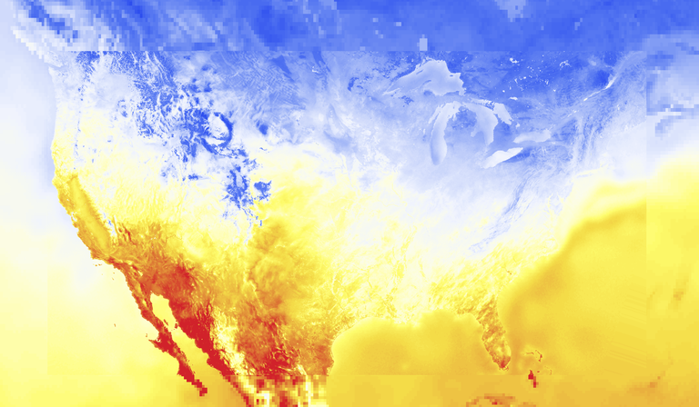

# tech.datatype

`tech.datatype` is for efficient N-dimensional numerics across a range of primitive
datatypes.

As examples of what you may do, here are some colorized tensors built from the US NOAA 
HRRR and GFS models.

| Morning Temps                           | Noon Temps                        | 
|---------                                |-------                            |
|||

* For a quick feel of the library, please check out our [cheatsheet](docs/cheatsheet.md)
* Check out our docs on [buffered images](docs/buffered-images.md)
* APL-style [game of life](test/tech/v2/apl/game_of_life.clj)

A nice (slightly out of date) post explaining more is 
[here](http://techascent.com/blog/datatype-library.html).

Generalized efficient manipulations of sequences of primitive datatype.
Includes specializations for java arrays, array views (subsection of an array)
and nio buffers.  There are specializations to allow implementations to provide
efficient full typed copy functions when the types can be ascertained.

  Generic operations include:
  1. datatype of this sequence
  2. Writing to, reading from
  3. Construction
  4. Efficient mutable copy into a container.
  5. Sparse buffer support
  6. n-dimensional tensor support
  7. Functional math support

Design documenation is [here](docs).

## Useful Unit Tests To See

* [basic operations](test/tech/v2/datatype_test.clj)
* [unsigned operations](test/tech/v2/datatype/typed_buffer_test.clj)
* [game of life](test/tech/v2/apl/game_of_life.clj)
* [sparse game of life](test/tech/v2/apl/sparse_game_of_life.clj)

## License

Copyright © 2019 TechAscent, LLC.

Distributed under the Eclipse Public License either version 1.0 or (at
your option) any later version.
